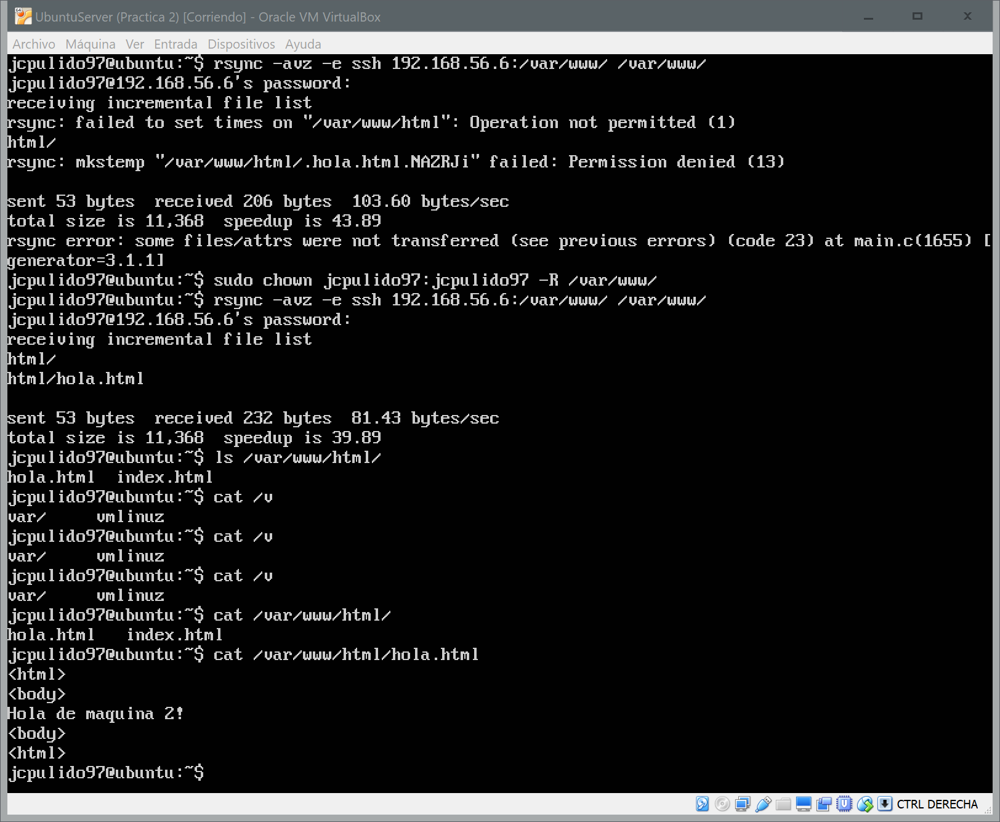
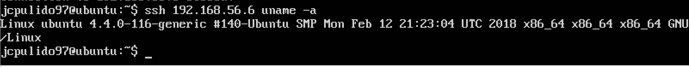
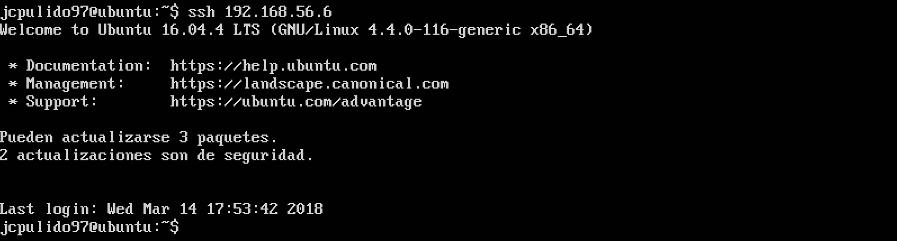

# Práctica 2

## Objetivos de la práctica
Los objetivos concretos de esta segunda práctica son:
- Aprender a copiar archivos mediante ssh
- Clonar contenido entre máquinas
- Configurar el ssh para acceder a máquinas remotas sin contraseña
- Establecer tareas en cron

## Cuestiones a resolver

  En esta práctica el objetivo es configurar las máquinas virtuales para trabajar en modo espejo, consiguiendo que una máquina secundaria mantenga siempre actualizada la información que hay en la máquina servidora principal.  

Hay que llevar a cabo las siguientes tareas:
  1. Probar el funcionamiento de la copia de archivos por ssh  
  2. Clonado de una carpeta entre las dos máquinas  
  3. Configuración de ssh para acceder sin que solicite contraseña  
  4. Establecer una tarea en cron que se ejecute cada hora para mantener actualizado el contenido del directorio /var/www entre las dos máquinas.
  
  Como resultado de la práctica 2 se mostrará al profesor el funcionamiento del proceso automático de clonado de la información. En el documento a entregar se describirá cómo se ha realizado la configuración de ambas máquinas y del software.

## Pasos

  - Comprimir "/var/www/html" y copiar a través de ssh y piping con cat:
  ```
    tar czf - /var/www/html | ssh 192.168.56.X 'cat > ~/tar.tgz'
  ```

  - Utilizar rsync para clonar contenido entre máquinas:
  ```
    sudo apt-get install rsync
    #Primero cambiar el propietario de la carpeta www para poder utilizar rsync
    sudo chown jcpulido97:jcpulido97 –R /var/www
    rsync -avz -e ssh 192.168.56.X:/var/www/ /var/www/ 
  ```
 
 
  - Configuración de ssh para acceder sin que solicite contraseña:
  ```
    ssh-keygen -b 4096 -t rsa
    chmod 600 ~/.ssh/authorized_keys
    ssh-copy -id 192.168.56.X
  ```
  A continuación ya podremos conectarnosa dicho equipo sin contraseña  
 
 
